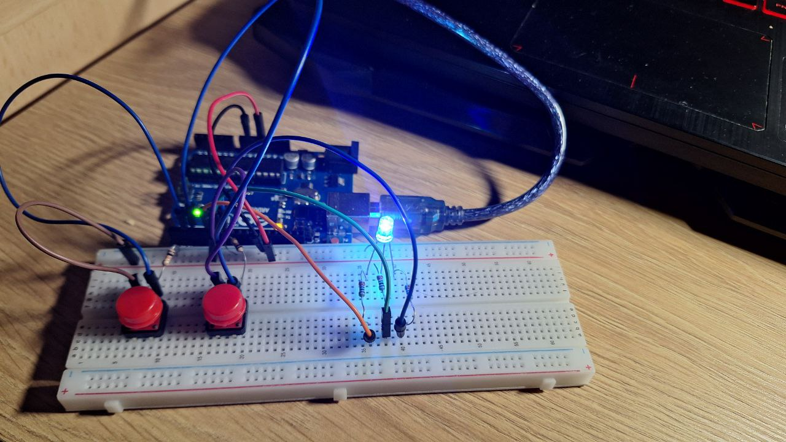
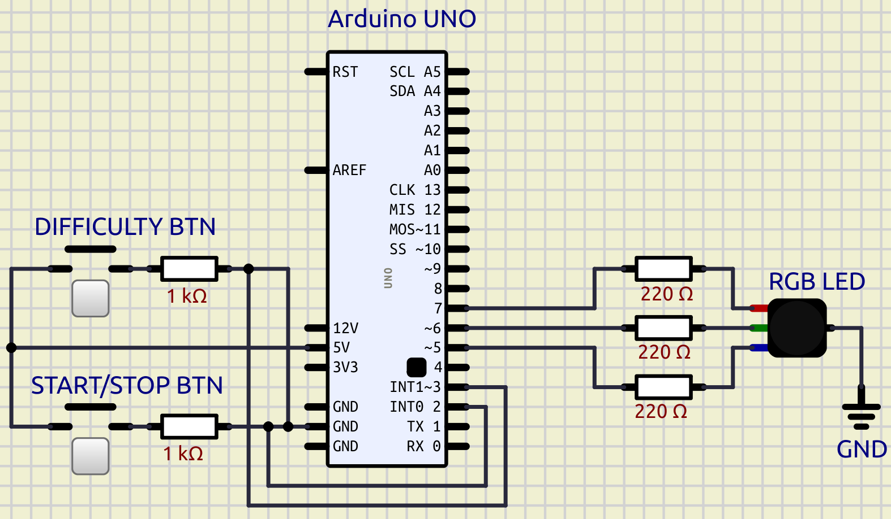

# Arduino Type Racer

This project is an Arduino-baced type-racer game. To win, you have to use the Serial Monitor and write the printed words doing as fewer mistakes as possible in order to get the biggest score.

## Table of Contents

1. [Projeect photo](#project-photo)
2. [Components](#components)
3. [Schematic](#schematic)
4. [Usage Video](#usage-video)

## Project photo

## Components
- Arduino UNO board
- x2 push buttons
- x1 RGB LED
- x3 220Ω resistors (for the LED)
- x2 1K resistors (for the buttons)
- jumper wires

> [!NOTE]
Both buttons use **pull-down** resistors.

## Schematic

## Usage Video

